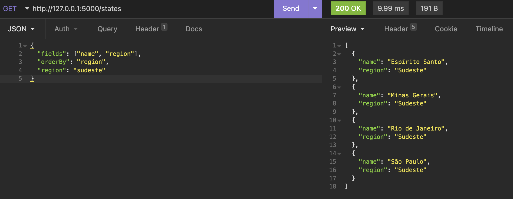
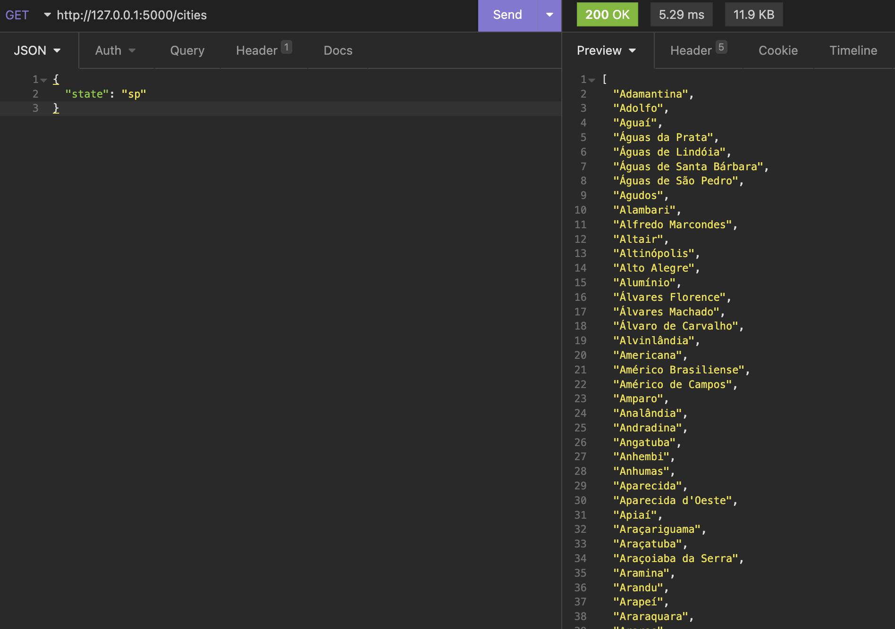

# Brazilian Locations Finder

This is a simple api that find Brazilian cities and states
You can see my app here:

## Install

    pip install -r requirements.txt

## Running the app locally

    flask run

### List states [GET `/states`]

+ Attributes (json object)

  + *fields* `(type: array; default: [name, initials, region, cities])`: fields that you can filter
  + *region* `(type: string (Norte | Nordeste | Centro-Oeste | Sul | Sudeste); default: "")`: regions that you can filter
    Centro-Oeste | Sul | Sudeste); default: "")`: regions that you can filter
  + *orderBy* `(type: string (name | initials | region | cities); default: "name")`: fields that you can sort

+ Response 200 (application/json)

  + Headers

            X-RateLimit-Limit: 60
            X-RateLimit-Remaining: 59

  + Body

            {
                "name": string,
                "region": string,
                "initials": string,
                "cities": [string]
            }
+ Example:
    

### List cities [GET `/cities`]

+ Attributes (json object)

  + *state* `(type: string; default: "")`: state that you can filter

+ Response 200 (application/json)

  + Headers

            X-RateLimit-Limit: 60
            X-RateLimit-Remaining: 59

  + Body
          [string]

+ Example:
    
